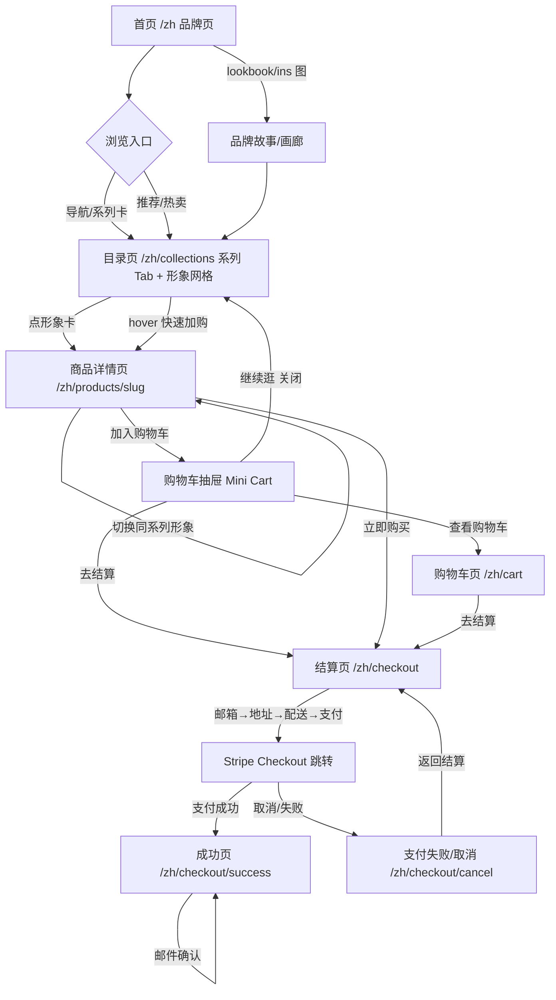

# 02 — 交互规格（UX Spec）

> PLAYCORE 凭空幻想 · is.offy 电商独立站
> 作者：交互专家 · 版本 v1.0 · 状态：待评审（Draft for Review）
> 输入：`docs/brand-brief.md`、`AGENTS.md`、`openspec/specs/commerce/spec.md`（预留能力）
> 参考站：[CASETiFY](https://www.casetify.cn/iphone-cases/iphone-17-pro-max-cases)、[dogguo.com](https://dogguo.com/)、[littlebeast.co](https://littlebeast.co/)

---

## 0. 术语表（中英对照）

| 中文 | English | 说明 |
| --- | --- | --- |
| 形象 | Character | 一个 Offy 的穿搭/情绪化身，即**一个商品** |
| 系列 | Series / Collection | 形象的分组：时尚包挂 / 经典毛绒 / 大号毛绒 / 定制 |
| 规格 | Variant / Spec | 同一形象的尺寸/材质（经典 18cm / 大号 30cm…），影响价格与库存 |
| SKU | SKU (Stock Keeping Unit) | 「形象 × 规格」的唯一可售单元 |
| 目录页 / 商品列表页 | PLP (Product Listing Page) | 形象卡片网格，按系列筛选 |
| 商品详情页 | PDP (Product Detail Page) | 单一形象的详情 + 购买面板 |
| 选款 | Choose a character | 选择某个 Offy 形象（本产品「选款」= 选形象，非选颜色） |
| 加购 | Add to Cart | 将 SKU 加入购物车 |
| 立即购买 | Buy Now | 跳过购物车直接进入结算 |
| 购物车抽屉 | Mini Cart Drawer | 加购后从右侧滑出的轻量购物车 |
| 结算页 | Checkout | 邮箱 → 收货地址 → 配送 → 支付 |
| 支付 | Payment | 跳转 Stripe Checkout（hosted） |
| 成功页 | Order Confirmation | 支付成功后的订单确认页 |

---

## 1. 参考站交互模式总结

### 1.1 CASETiFY（购买流程基准）

调研结论（[商品列表页](https://www.casetify.cn/iphone-cases/iphone-17-pro-max-cases)、[商品详情页](https://www.casetify.com/product/want--phone-case/iphone-17/clear-case) 等）：

1. **PLP（列表页）**：响应式卡片网格（桌面 3–4 列、移动 2 列）。卡片 = 设计图（artwork）+ 名称 + 价格。顶部系列导航 + 筛选/排序。整卡可点，hover 显示「快速加购」。
2. **PDP（详情页）**：左图右购（桌面）/ 上图下购（移动）。
   - **画廊**：多张大图可切换（正面/细节/场景）。
   - **型号选择器（Device Selector）**：下拉/横滑选择机型，是进入页面的先决条件（URL 常带 device 参数）。
   - **款式选择器（Case Style Selector）**：横向卡片（缩略图 + 名称 + 价格差），选中高亮描边。
   - **颜色/设计选择器**：色块或缩略图 swatch，点击即时换图。
   - **数量 stepper**：`-` / `+`，最少 1，上限库存。
   - **价格**：随选择实时更新。
   - **CTA**：主按钮「加入购物车」，移动端底部**粘性购买条（sticky bar）**（价格 + 加购按钮常驻）。
3. **加购反馈**：点击后弹出**右侧购物车抽屉（mini cart drawer）**——显示已加入商品（图/名/规格/单价/数量）、小计、「去结算」+「继续逛」，并带「你可能还喜欢」upsell。抽屉可快速增减数量、删除。
4. **购物车**：抽屉为轻量入口，另设完整购物车页可编辑数量/删除/输入优惠码。
5. **结算**：两栏布局——左表单（邮箱 → 收货地址 → 配送方式 → 支付），右**订单摘要**（商品、小计、运费、税、合计）。步骤可折叠/渐进式。
6. **支付**：支持卡 + 快捷支付（Apple Pay / PayPal 等），跳转 Stripe/第三方，成功后回跳订单确认页（含订单号，邮件确认）。

**可借鉴模式**：型号/款式/颜色的**分层选择器**、选择后即时换图与价格联动、**粘性加购条**、**购物车抽屉反馈**、**两栏结算 + 订单摘要**。

### 1.2 dogguo.com（品牌展示）

[dot carrier bag 产品页](https://dogguo.com/products/dot-carrier-bag-kopie)：极简大图 + 干净排版，产品页多图画廊 + 规格下拉 + 加购；品牌页以**生活方式图 + 设计语言（波点图案）**贯穿，强化 IP 一致性。

**可借鉴**：以**视觉识别（波点 = 我们的黑肤卡通 IP + 情绪穿搭）**统一首页与商品，图片优先、文案克制。

### 1.3 littlebeast.co（品牌展示）

[World's Your Oyster Onesie](https://littlebeast.co/products/worlds-your-oyster-onesie)：宠物服饰独立站，编辑部/lookbook 风格首页，产品卡 + 变体选择（尺码）+ 加购；品牌叙事强（"luxury pet apparel"）。

**可借鉴**：首页用 **lookbook/编辑部叙事**（对应 `resources/ins/` 23 张图 + 品牌手册）塑造"情绪穿搭"世界观，再自然导流到商城。

---

## 2. 设计原则与核心概念映射

**核心映射**：Casetify 的「选机型/款式/颜色」→ Offy 的「选形象/系列/规格」。

| Casetify 概念 | Offy 映射 | 交互载体 |
| --- | --- | --- |
| 选 artwork（列表页选设计） | **选形象**（列表页选 Offy 形象） | PLP 形象卡片 |
| 型号选择器（Device） | **系列选择器**（包挂/经典/大号/定制） | PLP 系列 Tab / PDP 面包屑 |
| 款式/颜色 swatch | **形象选择器**（同系列内切换形象） | PDP 形象缩略图网格 |
| 壳型/材质（Case type） | **规格选择器**（18cm / 大号 30cm） | PDP 规格 chips |

**决策 D1（商品=形象）**：一个 URL 指向**一个形象**（`/zh/products/<slug>`），规格是它的变体。这样「每个商品 = 一个 Offy 形象」成立，形象即商品、可独立分享/SEO。

**设计原则：**
- **P1 情感优先**：购买 = "挑选与你共鸣的她"。文案与交互引导用户"选情绪"，而非"选参数"。
- **P2 图片优先、移动优先**：产品图 3:4 竖版，移动端全宽大图 + 底部粘性操作。
- **P3 即时反馈**：任何选择（形象/规格/数量）即时更新预览、价格、库存，无整页刷新。
- **P4 低摩擦结算**：抽屉反馈 → 一步到位结算 → Stripe 托管支付，减少表单跳转。
- **P5 可扩展 i18n**：所有文案走 i18n 资源，URL 前缀 `/zh` `/en`，便于未来加语言。

---

## 3. 完整用户流程图

**分步说明（含路由）：**

| 步骤 | 页面/路由 | 关键动作 |
| --- | --- | --- |
| 1 | 首页 `/zh` | 品牌 hero、系列入口、热卖形象、lookbook、订阅 |
| 2 | 目录 `/zh/collections` | 系列筛选、排序、形象卡片 → 详情 |
| 3 | 详情 `/zh/products/<slug>` | 形象选择器、规格、数量 → 加购/立即购买 |
| 4 | 购物车抽屉（全局） | 加购反馈、快速编辑、去结算 |
| 5 | 购物车页 `/zh/cart` | 数量增减、删除、优惠码 |
| 6 | 结算 `/zh/checkout` | 邮箱 → 地址 → 配送 → 支付 |
| 7 | Stripe Checkout（外部） | 卡支付 / 取消 |
| 8 | 成功 `/zh/checkout/success` | 订单号、摘要、后续引导 |

---

## 4. 关键页面交互细节与状态

> 通用状态语义（全站统一）：
> - **Loading**：骨架屏（skeleton）而非空白；图片 `blur-up` 渐进加载。
> - **Empty**：明确文案 + 一个主 CTA 引导（如"去挑选你的 Offy"）。
> - **Error**：卡片内联错误 + 重试按钮，不整页白屏。
> - **库存不足**：禁用加购，显示"已售罄"；可选"到货提醒"。
> - **重复加购**：不新增行，数量 +1 并 toast「已在购物车，数量 +1」。
> - **离线/网络失败**：操作按钮进入 loading，失败回滚 + 错误提示。

### 4.1 首页 / 品牌页（`/zh`）

**目的**：传递"让想象落地，让陪伴发生"的世界观，导流至商城。

**布局（移动优先，桌面增强）**：
1. **Hero**：大图/视频 + Slogan + 主 CTA「挑选我的 Offy」→ `/collections`。
2. **系列入口**：4 张系列卡（时尚包挂 / 经典毛绒 / 大号毛绒 / 定制）→ 对应筛选目录。
3. **热卖形象**：横向滚动形象卡（复用目录卡），直达 PDP。
4. **品牌故事 / lookbook**：引用 `resources/ins/` 生活方式图 + 品牌手册叙事（dogguo/littlebeast 风格），CTA 指向画廊或详情。
5. **订阅（Newsletter）**：邮箱输入 + 订阅按钮（里程碑已实现，见 `openspec/specs/newsletter`）。
6. **页脚**：渠道背书（上海 TX 淮海 / 杭州 in77 / 曼谷 Warehouse30_6）、联系、语言切换、政策链接。

**状态**：
- Loading：hero 与系列卡用骨架屏。
- Error：图片加载失败显示占位 + 品牌主色底，不影响文字导航。
- Empty（无热卖数据）：隐藏该区块，不渲染空标题。

### 4.2 目录页 / 商品列表页（`/zh/collections`）

**布局**：
- 顶部：标题 + **系列 Tab**（全部 / 时尚包挂 / 经典毛绒 / 大号毛绒 / 定制）。
- 工具条：结果计数 + 排序（默认推荐 / 最新 / 价格升/降）。
- **形象卡片网格**（移动 2 列，桌面 3–4 列）：
  - 形象图（3:4，`/zh/products/<slug>` 直达）。
  - 系列标签（chip）+ 形象名 + 价格。
  - **售罄覆盖层**：「已售罄 SOLD OUT」灰化。
  - **快速加购**：桌面 hover / 移动长按出现「+ 加购」按钮（仅当规格唯一或已选默认规格时可用；多规格则跳详情）。

**状态**：
- Loading：卡片骨架屏。
- Empty（筛选无结果）："这个系列还没有 Offy，去别的系列看看" + 「清除筛选」按钮。
- Error：加载失败显示重试按钮。
- 库存不足：卡片显示"已售罄"，点击仍可进详情看「到货提醒」。

### 4.3 商品详情页（`/zh/products/<slug>`）★ 核心

**布局**：左图右购（桌面 ≥1024px）/ 上图下购（移动，底部粘性购买条）。

**① 画廊（左）**：形象多图（正面/背面/细节/生活场景）主图 + 缩略图切换；支持滑动/捏合缩放（移动）。

**② 购买面板（右）**：自上而下——

- **面包屑**：首页 / 系列 / 形象名。
- **标题区**：系列 chip + 形象名（中/英）+ 价格（随规格联动）。
- **形象选择器（Character Selector）** ★：
  - **作用**：在同一系列内切换形象 = 换"她"（映射 Casetify 的颜色/设计 swatch）。
  - **形态**：横向滚动缩略图条（桌面可展开为网格），每项 = 形象缩略图 + 名称 + 价格（可选）。
  - **行为**：点击 → 即时切换画廊、名称、价格、规格、库存、URL（`history.replaceState` 或跳转至该形象 slug，保持可分享）。
  - **状态**：当前形象高亮描边；切换时画廊淡入过渡；某形象售罄显示灰化 + "售罄"角标（仍可点看）。
  - **语义**：`role="radiogroup"` / 每项 `role="radio"` + `aria-checked`。
- **规格选择器（Spec Selector）**：
  - **作用**：选尺寸/材质（经典 18cm / 大号 30cm…），映射 Casetify 的壳型。
  - **形态**：chips（单选），显示规格名 + 价格（+¥xx 或含差价）。
  - **行为**：选中即时更新价格、库存；无库存规格禁用 + "售罄"。
  - **状态**：规格切换后若当前数量 > 库存则自动降为库存上限。
- **数量 stepper**：`-` / `+`，最少 1，最多当前规格库存；长按可快速增减。
- **CTA**：
  - 主按钮「加入购物车 Add to Cart」（品牌主色，实心）。
  - 次按钮「立即购买 Buy Now」（描边）→ 直接进结算。
  - **售罄态**：主按钮变「到货提醒 Notify Me」（打开邮箱输入弹层）。
- **信任与信息区**：可折叠 accordion——尺寸规格（PCOF1 通用 18cm 等）/ 材质与环保 / 系列故事 / 联名与定制说明 / 退换政策。

**③ 底部粘性购买条（移动）**：价格 + 「加入购物车」常驻底部，滚动时可见；展开购物车抽屉后隐藏。

**④ 相关推荐**：底部"你可能也喜欢的她"形象卡横滑。

**状态汇总**：
- Loading：画廊骨架 + 面板骨架。
- 库存不足/售罄：见上，加购禁用 + 到货提醒。
- 重复加购：加购后抽屉/toast 提示数量 +1。
- 支付能力不可用（预留）：加购正常，结算按钮提示"即将开放"。

### 4.4 购物车（抽屉 + 独立页）

**决策 D2：抽屉为主反馈，独立页为编辑主场景。**（对齐 Casetify 的 mini cart）

**① 购物车抽屉（Mini Cart Drawer）**：
- 触发：点「加入购物车」或点 header 购物车图标。
- 形态：桌面右侧滑出（宽 ~380px）；移动端**全屏底部抽屉**（bottom sheet，可下拉关闭）。
- 内容：
  - 头部：标题「购物车」+ 件数 + 关闭。
  - 行项：图 + 形象名 + 规格 + 单价 + 数量 stepper + 删除（×）。
  - 小计 + 免运费进度条（如"再买 ¥xx 免运费"，可选）。
  - **upsell**：「你可能还喜欢」横滑。
  - 底部：小计 + 「去结算」+ 「查看购物车」链接。
- **状态**：空态（"购物车还是空的" + 「去挑选 Offy」）；数量减到 0 自动移除行；删除有轻量确认（移动端）。

**② 购物车页（`/zh/cart`）**：
- 桌面两栏（行项列表 + 订单摘要），移动单栏。
- 行项：数量 stepper、删除、单价、行小计；全选/批量删除（可选）。
- **优惠码**（可选能力）：输入框 + 应用，折扣行显示，无效码内联报错。
- 订单摘要：小计、运费（未选地址则"结算时计算"）、优惠、合计。
- CTA：「去结算」。
- **状态**：空态、数量修改即时重算合计、删除即时更新、优惠码错误内联提示。

**加购反馈（全局）**：加购成功后——桌面弹抽屉；移动端弹底部抽屉 + 顶部 toast「已加入购物车」。**重复加购**不新增行，数量 +1。

### 4.5 结算页（`/zh/checkout`）

**决策 D3：单页渐进式结算 + 订单摘要侧栏。**（对齐 Casetify 两栏，移动端折叠）

**结构（桌面两栏 / 移动单栏 + 折叠摘要）**：
- **左：表单（分节，逐节完成）**
  1. **邮箱 Contact**：邮箱输入（用于订单确认），可折叠。
  2. **收货地址 Shipping**：姓名、国家/地区、省/市、详细地址、邮编、手机号；地址校验。
  3. **配送方式 Delivery**：标准 / 加急（含预估送达时间与费用），单选。
  4. **支付 Payment**：说明将跳转 Stripe 安全支付（卡）；「确认并支付」按钮。
- **右：订单摘要（Order Summary）**：行项（图/名/规格/数量）、小计、运费、税、合计；返回购物车链接。

**校验与状态**：
- 逐字段实时校验（zod），非法字段红框 + 错误文案；"确认并支付"在全部合法前禁用。
- 提交中：按钮 loading（"处理中…"），防重复提交。
- 库存不足（提交时后端校验失败）：内联提示并返回购物车。
- 网络/接口失败：错误横幅 + 重试。

### 4.6 支付（Stripe Checkout，跳转）

- 提交结算 → 服务端创建 Stripe Checkout Session → 前端 `redirectToCheckout` 跳转 **Stripe 托管支付页**。
- `success_url` → `/zh/checkout/success?session_id={CHECKOUT_SESSION_ID}`；`cancel_url` → `/zh/checkout/cancel`。
- 服务端通过 **webhook**（`checkout.session.completed`）落单/减库存/发确认邮件，而非仅依赖前端回跳。

**状态**：
- 取消（cancel）：返回 `/zh/checkout/cancel`，提示"支付未完成"，购物车**保留**，提供「返回结算」。
- 失败（payment failed）：webhook 收到失败事件，订单标失败，回跳同样进入 cancel/失败页提示"支付失败，请换卡重试"。
- 已支付重复回跳：幂等处理，跳成功页不重复落单。

### 4.7 成功页（`/zh/checkout/success`）

- 头部：成功标记 + "感谢你的选择，她正在来的路上"。
- 订单摘要：订单号、商品行项、收货信息、金额、预计送达。
- 说明：确认邮件已发送至邮箱。
- CTA：「继续逛」→ 目录 / 「关注我们」→ 社交。
- **状态**：session_id 无效/过期 → 显示通用成功态或引导回首页（不泄露敏感信息）。

---

## 5. 全局交互

### 5.1 多语言切换（中/英）

- **URL 策略**：前缀 `/zh` `/en`（默认 `/zh`；未来可扩展 `/ja` 等）。无前缀访问 `/` 302 重定向到 `/zh`。
- **切换器位置**：Header 右上角（桌面）+ 移动端菜单内；页脚再放一处。形态：语言图标/「中 EN」下拉，或直接「中文 / EN」双选。
- **行为**：
  - 切换后跳转到**当前页面的对应语言版本**（`/zh/products/x` ↔ `/en/products/x`），保持 slug/参数；找不到对应时回退语言首页。
  - 记住偏好（cookie/localStorage `locale`），下次访问默认该语言。
  - `<html lang>` 同步切换，所有文案（含动态商品名/描述）走 i18n 资源，商品名维护中英字段。
  - 切换不丢购物车内容（购物车按 SKU 存，与语言无关）。
- **AC 见 §6.6。**

### 5.2 移动端优先响应式

| 断点 | 布局要点 |
| --- | --- |
| < 640px（手机） | 单列；2 列形象网格；PDP 上图下购 + **底部粘性购买条**；抽屉改**底部全屏 sheet**；结算单栏 + 折叠摘要；汉堡菜单 |
| 640–1024px（平板） | 3 列网格；PDP 可选左图右购；抽屉右侧滑出 |
| ≥ 1024px（桌面） | 4 列网格；PDP 左图右购（图 60% / 购 40%）；两栏结算 |

- 触控目标 ≥ 44×44px；stepper 按钮足够大；图片懒加载 + 响应式 `srcset`。
- 手势：移动端画廊滑动切换、底部抽屉下拉关闭、图片捏合缩放。

### 5.3 状态与边界统一

| 场景 | 统一处理 |
| --- | --- |
| 加购成功 | 抽屉（桌面）/ 底部 sheet + toast（移动） |
| 重复加购 | 数量 +1，不新增行，toast「已在购物车，数量 +1」 |
| 数量增减 | stepper 即时重算行小计与合计；减到 0 移除；超库存封顶 |
| 删除 | 即时移除 + 重算合计；可轻量撤销（可选） |
| 库存不足 | 加购禁用 + 「售罄/到货提醒」；结算提交时后端兜底校验 |
| 空态 | 文案 + 主 CTA 引导 |
| Loading | 骨架屏 + 按钮 loading |
| Error | 内联错误 + 重试，不整页白屏 |
| 支付取消/失败 | 购物车保留 + 返回结算入口 |

### 5.4 无障碍（A11y）与语义

- 选择器用 `radiogroup`/`radio` + `aria-checked`；卡片/图片有 `alt`（形象名）。
- 焦点可见、键盘可操作（Tab 遍历、Enter/Space 触发）；抽屉/弹层 `role="dialog"` + `aria-modal` + Esc 关闭 + 焦点陷阱。
- 色彩对比达标；状态不只靠颜色（售罄同时有文字）。

---

## 6. 关键交互验收标准（Given-When-Then）

### 6.1 选形象（PDP 形象选择器）
- **GIVEN** 用户在商品详情页，且当前形象属于「经典毛绒」系列
- **WHEN** 用户点击同系列形象选择器中的另一个形象缩略图
- **THEN** 画廊主图、形象名、价格、规格可用性与库存**即时更新**为该形象；URL 更新为该形象 slug（可分享/刷新不丢失）；选中项高亮并置 `aria-checked=true`

### 6.2 选规格联动
- **GIVEN** 用户已选形象，规格含「经典 18cm」与「大号 30cm」，两者价格不同
- **WHEN** 用户切换规格
- **THEN** 价格与库存即时更新；若当前数量超过新规格库存，数量自动降为库存上限；无库存规格显示"售罄"且不可选

### 6.3 加购反馈（抽屉）
- **GIVEN** 用户在桌面端商品详情页
- **WHEN** 用户点击「加入购物车」
- **THEN** 右侧滑出购物车抽屉，显示该 SKU（图/形象名/规格/单价/数量=1）、小计、upsell、「去结算」；Header 购物车图标角标 +1

### 6.4 重复加购
- **GIVEN** 购物车已含「原皮 Offy · 经典 18cm」数量 1
- **WHEN** 用户再次加入同一 SKU
- **THEN** 不新增行，该行数量变 2，行小计与合计翻倍；提示「已在购物车，数量 +1」

### 6.5 购物车数量增减与删除
- **GIVEN** 购物车页某行数量为 1
- **WHEN** 用户点击该行 `-`
- **THEN** 该行移除，合计即时重算；空态显示"购物车还是空的"+「去挑选 Offy」
- **GIVEN** 购物车页某行数量为 2
- **WHEN** 用户点击 `+`
- **THEN** 数量变 3 且不超过库存；行小计与合计即时更新

### 6.6 多语言切换
- **GIVEN** 用户在 `/zh/products/offy-active`，站内已存在英文版 `/en/products/offy-active`
- **WHEN** 用户将语言切换为 EN
- **THEN** 跳转到 `/en/products/offy-active`，页面文案全英文，`<html lang="en">`；购物车内容与数量不变
- **GIVEN** 用户首次访问 `/`（无语言前缀）
- **WHEN** 加载完成
- **THEN** 302 重定向到 `/zh`（或按已存语言偏好重定向）

### 6.7 结算校验与提交
- **GIVEN** 用户到达结算页，邮箱/地址字段为空或非法
- **WHEN** 用户点击「确认并支付」
- **THEN** 按钮禁用或提交被拦截，非法字段红框 + 内联错误文案，不发生跳转
- **GIVEN** 所有字段合法
- **WHEN** 用户点击「确认并支付」
- **THEN** 按钮 loading（防重复），随后跳转 Stripe Checkout 支付页

### 6.8 支付成功
- **GIVEN** 用户在 Stripe 完成支付
- **WHEN** 回跳 `/zh/checkout/success?session_id=…`
- **THEN** 显示成功态 + 订单号 + 商品摘要 + 收货信息 + 预计送达；确认邮件已发送；购物车清空

### 6.9 支付取消 / 失败
- **GIVEN** 用户在 Stripe 取消支付（或支付失败）
- **WHEN** 回跳 `/zh/checkout/cancel`
- **THEN** 显示"支付未完成/失败"，购物车**保留**，提供「返回结算」按钮

### 6.10 库存不足（结算兜底）
- **GIVEN** 用户提交结算时，某 SKU 已被售罄
- **WHEN** 服务端校验库存失败
- **THEN** 不创建支付会话，页面内联提示"「xx」已售罄，请移除后重试"，并返回购物车

---

## 7. 最关键交互决策（3 个）

1. **「选款 = 选形象」**：形象即商品，PDP 的**形象选择器**沿用 Casetify 颜色/设计 swatch 的"点选即换图+换价"心智，但映射到"选一个与你共鸣的她"，并以 URL=形象 slug 保证可分享/SEO（§4.3）。
2. **加购反馈用购物车抽屉 + 独立页双层**：抽屉负责轻量即时反馈与 upsell（对齐 Casetify mini cart），独立 `/cart` 页负责数量增减/删除/优惠码的完整编辑；移动端抽屉退化为全屏底部 sheet（§4.4）。
3. **单页渐进式结算 + Stripe 托管跳转 + webhook 落单**：表单分节（邮箱→地址→配送→支付）+ 订单摘要侧栏（移动折叠）；支付用 Stripe Checkout 托管跳转，订单以 webhook 为准幂等落单，成功/取消分别回跳，取消保留购物车（§4.5–4.6）。

---

## 8. 待确认项（Open Questions）

1. 每个形象的**中英文名 + 价格 + 图↔编码映射**（`brand-brief.md` §9 暂缺，需产品数据补全）。
2. **优惠/折扣**是否纳入首期（本 spec 以"可选"标记，未纳入核心 AC）。
3. 免运费门槛与**运费规则/地区**（影响结算配送方式与进度条）。
4. 支付渠道范围（仅 Stripe 卡，还是加 Apple Pay / PayPal / Alipay 等快捷支付）。
5. 定制系列（Custom Collection）的交互（本 spec 暂按"到货提醒/联系定制"处理，未做定制器）。
6. 会员/账户体系（首期是否纯访客购物 + 邮箱留痕，不做注册登录）。

---

*本文件为交互规格（UX Spec），供产品/美术/web/前端/测试专家共同使用；落地实现需先按 `AGENTS.md` 走 OpenSpec spec-first + TDD 流程，为 commerce 预留能力补充 spec delta。*
